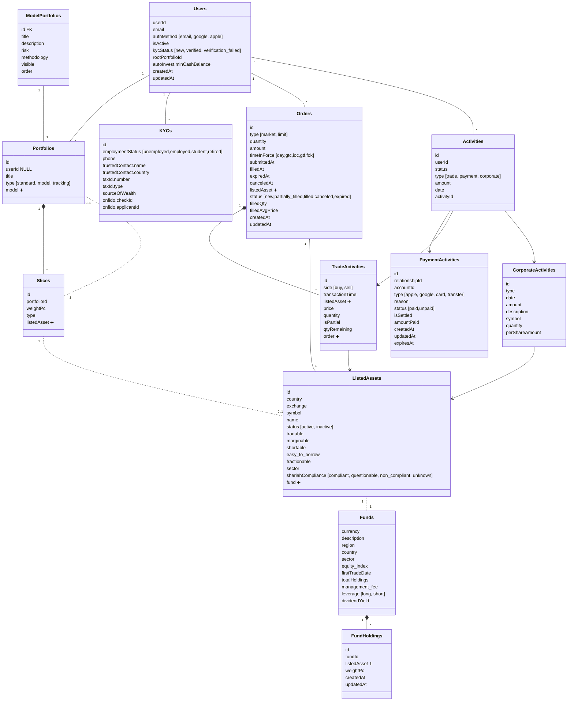

```mermaid
%% ➕ refers to an embedded object
%% [] represent valid enum values
%% . represent nested object properties

classDiagram
Users "1" -- "*" Portfolios
Users "1" -- "*" KYCs
Users "1" -- "*" Orders
Users "1" -- "*" Activities

ModelPortfolios "1" -- "1" Portfolios
Portfolios "1" *-- "*" Slices
Slices "1" .. "0..1" ListedAssets
Slices "1" .. "0..1" Portfolios

Activities --> PaymentActivities
Activities --> TradeActivities
Activities --> CorporateActivities

Orders "1" *-- "* "TradeActivities

Orders "1" -- "1" ListedAssets
TradeActivities --> ListedAssets
CorporateActivities --> ListedAssets

ListedAssets "1" .. "1" Funds
Funds "1" *-- "*" FundHoldings

%% Detailed models:

Users: userId
Users: email
Users: authMethod [email, google, apple]
Users: isActive
Users: kycStatus [new, verified, verification_failed]
Users: rootPortfolioId
Users: autoInvest.minCashBalance
Users: createdAt
Users: updatedAt

Orders: id
Orders: type [market, limit]
Orders: quantity
Orders: amount
Orders: timeInForce [day,gtc,ioc,gtf,fok]
Orders: submittedAt
Orders: filledAt
Orders: expiredAt
Orders: canceledAt
Orders: listedAsset ➕
Orders: status [new,partially_filled,filled,canceled,expired]
Orders: filledQty
Orders: filledAvgPrice
Orders: createdAt
Orders: updatedAt

Portfolios: id
Portfolios: userId NULL
%% userId = NULL means it's public
Portfolios: title
Portfolios: type [standard, model, tracking]
Portfolios: model ➕

ModelPortfolios: id FK
ModelPortfolios: title
ModelPortfolios: description
ModelPortfolios: risk
ModelPortfolios: methodology
ModelPortfolios: visible
ModelPortfolios: order

Slices: id
Slices: portfolioId
Slices: weightPc
Slices: type
Slices: listedAsset ➕

Funds: currency
Funds: description
Funds: region
Funds: country
Funds: sector
Funds: equity_index
Funds: firstTradeDate
Funds: totalHoldings
Funds: management_fee
Funds: leverage [long, short]
Funds: dividendYield

FundHoldings: id
FundHoldings: fundId
FundHoldings: listedAsset ➕
FundHoldings: weightPc
FundHoldings: createdAt
FundHoldings: updatedAt

KYCs: id
KYCs: employmentStatus [unemployed,employed,student,retired]
KYCs: phone
KYCs: trustedContact.name
KYCs: trustedContact.country
KYCs: taxId.number
KYCs: taxId.type
KYCs: sourceOfWealth
KYCs: onfido.checkId
KYCs: onfido.applicantId


ListedAssets: id
ListedAssets: country
ListedAssets: exchange
ListedAssets: symbol
ListedAssets: name
ListedAssets: status [active, inactive]
ListedAssets: tradable
ListedAssets: marginable
ListedAssets: shortable
ListedAssets: easy_to_borrow
ListedAssets: fractionable
ListedAssets: sector
ListedAssets: shariahCompliance [compliant, questionable, non_compliant, unknown]
ListedAssets: fund ➕

Activities: id
Activities: userId
Activities: status
Activities: type [trade, payment, corporate]
Activities: amount
Activities: date
Activities: activityId

TradeActivities: id
TradeActivities: side [buy, sell]
TradeActivities: transactionTime
TradeActivities: listedAsset ➕
TradeActivities: price
TradeActivities: quantity
TradeActivities: isPartial
TradeActivities: qtyRemaining
TradeActivities: order ➕

CorporateActivities: id
CorporateActivities: type
CorporateActivities: date
CorporateActivities: amount
CorporateActivities: description
CorporateActivities: symbol
CorporateActivities: quantity
CorporateActivities: perShareAmount

PaymentActivities: id
PaymentActivities: relationshipId
PaymentActivities: accountId
PaymentActivities: type [apple, google, card, transfer]
PaymentActivities: reason
PaymentActivities: status [paid,unpaid]
PaymentActivities: isSettled
PaymentActivities: amountPaid
PaymentActivities: createdAt
PaymentActivities: updatedAt
PaymentActivities: expiresAt
```